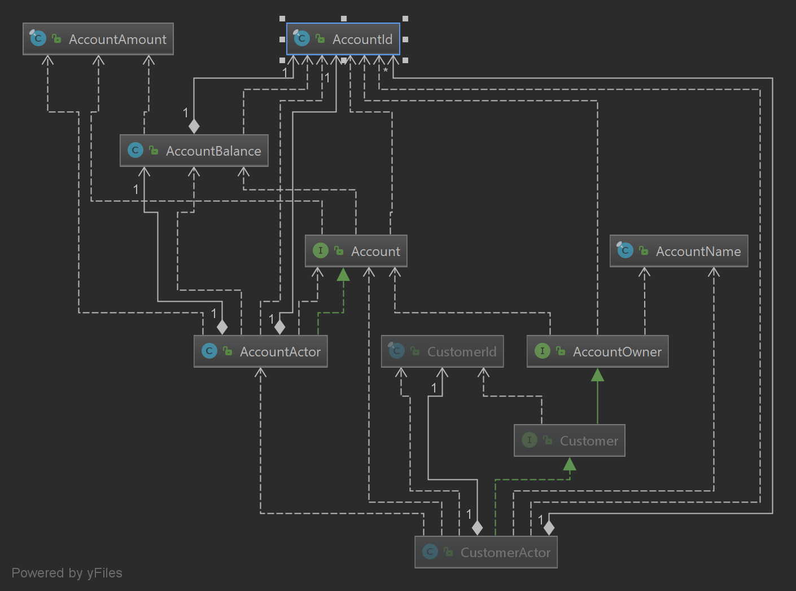

vlingo-bank-example
===================

Example application that shows how to write an application using vlingo/http and vlingo/actors. 
The Aggregate Roots and Value Objects diagram showing the relationship between domains is the following one:

Features
--------

* Creates customers that can hold N accounts
* Creates accounts with an initial balance of 0
* Get balance of an account
* Deposit money into an account
* Withdraw money from an account
* Transfer money between accounts (from the same Customer and different Customers)
* Delete accounts (when the balance is 0)

You can see a list of valid requests and a user flow in the [HTTP Test Suite](src/test/http/customer.http).

To Do
-----

* Unit tests for vlingo actors
* Flatten `Complete<T>` calls when supported.
* Error handling